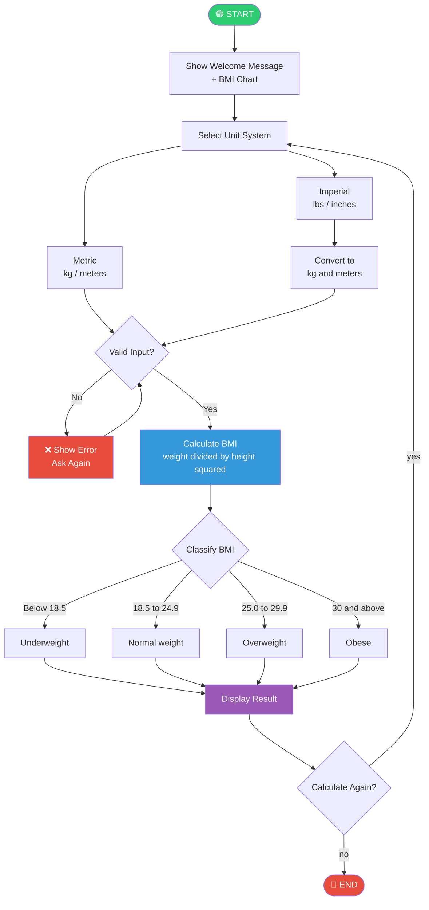

# 🏃 BMI Calculator


A command-line BMI (Body Mass Index) Calculator built in Python. This project takes user inputs like weight and height, calculates the BMI, and classifies it into standard WHO health categories. It supports both Metric and Imperial unit systems with proper input validation and error handling.
> Built as part of the OIBSIP Internship Program — Task 1

## Author
**Yuvaraj.T.K** — Python Intern @ Oasis Infobyte

## How to Run

```bash
python bmi_calculator.py
```

## Features

- Supports both **Metric** (kg/meters) and **Imperial** (lbs/inches) units
- Calculates BMI using the formula: `BMI = weight / (height × height)`
- Classifies BMI into health categories
- Handles invalid inputs gracefully
- Allows multiple calculations in one session

## BMI Categories

| BMI Range     | Category      |
|---------------|---------------|
| Below 18.5    | Underweight   |
| 18.5 – 24.9   | Normal weight |
| 25.0 – 29.9   | Overweight    |
| 30.0 & above  | Obese         |

## Sample Output

```
=============================================
    🏃 WELCOME TO BMI CALCULATOR 🏃
=============================================

  Select unit system:
  1. Metric   (kg / meters)
  2. Imperial (lbs / inches)
  Enter 1 or 2: 1

  Enter your weight (in kg)    : 70
  Enter your height (in meters): 1.75

=============================================
         📊  BMI CALCULATOR RESULT
=============================================
  Weight        : 70.0 kg
  Height        : 1.75 m
  Your BMI      : 22.86
  Category      : Normal weight
---------------------------------------------
  ✅  Great! You have a healthy BMI. Keep it up!
=============================================
```

## Program Flow



## Concepts Used

- Functions
- User input & validation
- Exception handling (try/except)
- If/elif/else conditions
- While loops
- Unit conversion


## Requirements

- Python 3.x or above
- No external libraries needed — uses Python built-in functions only


#oasisinfobyte #oasisinfobytefamily #internship #python
