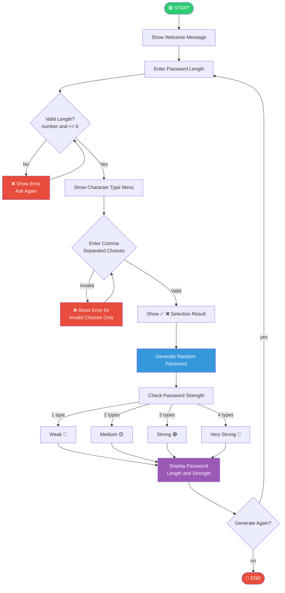

# 🔐 Password Generator


A command-line **Password Generator** built in Python. This project generates a random secure password based on user preferences like length and character types. It supports uppercase letters, lowercase letters, numbers and special characters with a built-in **password strength checker** and an intuitive **comma-based selection menu**.

## Author
**Yuvaraj.T.K** — Python Intern @ Oasis Infobyte

## Requirements

- Python 3.x or above
- No external libraries needed — uses Python built-in modules only (`random`, `string`)

## How to Run

```bash
python password_generator.py
```

## Features

- Choose password length (minimum 6)
- Select character types using comma-separated input (e.g. `1,2,4`)
- Visual ✅ ❌ feedback for selected and unselected types
- Handles invalid choices gracefully — accepts valid ones, rejects invalid ones
- Password strength indicator (Weak / Medium / Strong / Very Strong)
- Allows generating multiple passwords in one session

## Password Strength

| Types Selected | Strength      |
|----------------|---------------|
| 1 type         | Weak 🔴       |
| 2 types        | Medium 🟡     |
| 3 types        | Strong 🟢     |
| 4 types        | Very Strong 💪|

## Sample Output

```
==================================================
    🔐 WELCOME TO PASSWORD GENERATOR 🔐
==================================================

  Enter password length (min 6): 12

  Select character types:
  --------------------------------------
  ⬜  1.  Uppercase Letters    ( A - Z )
  ⬜  2.  Lowercase Letters    ( a - z )
  ⬜  3.  Numbers              ( 0 - 9 )
  ⬜  4.  Special Characters   ( @ # $ )
  --------------------------------------
  💡 Enter choices separated by comma
     e.g.  1,2  or  1,3,4  or  1,2,3,4

  Your choice: 1,2,3,4

  Character types selected:
  --------------------------------------
  ✅  1.  Uppercase Letters    ( A - Z )
  ✅  2.  Lowercase Letters    ( a - z )
  ✅  3.  Numbers              ( 0 - 9 )
  ✅  4.  Special Characters   ( @ # $ )
  --------------------------------------

==================================================
         🔑  GENERATED PASSWORD
==================================================
  Password : aB3@kLmN7#pQ
  Length   : 12 characters
  Strength : Very Strong 💪

  ✅ Copy and save your password safely!
==================================================
```

## Program Flow



## Concepts Used

- `random` module
- `string` module
- Functions
- User input & validation
- Exception handling (try/except)
- Loops (while, for)
- If/elif/else conditions
- Set operations

#oasisinfobyte #oasisinfobytefamily #internship #python